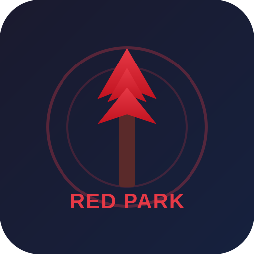

# Red Park Secret Access



## Какво е Red Park Secret Access?

Red Park Secret Access е образователен проект, който цели да осъзнава потребителите за рисковете от отваряне на непознати линкове. Сайтът демонстрира потенциалните възможности на уеб страници, стартирани в браузъра, като необичайни взаимодействия или неочаквани действия.

**Внимание:**
Сайтът е напълно безопасен. Не причинява никакви щети на вашето устройство. Всички функции са с образователна цел, а изтеглените файлове (снимки, видеа) са без вируси.

---

## Как да допринесете?

Red Park Secret Access е проект с отворен код и всеки може да се включи!

- Добавете нови функции, например нови необичайни взаимодействия в браузъра.
- Разширете сайта с нови механизми.
- Предложете идеите си чрез **Pull Request**!

---

## Как да започнете?

1. Клонирайте хранилището:
   ```bash
   git clone https://github.com/7147I/redpark-early-acsess.git
   cd redpark-early-acsess
   ```
2. Отворете проекта в любимия си редактор.
3. Направете промени и ги тествайте локално.
4. Подайте Pull Request!

---

## Вдъхновение

Проектът е създаден на базата на популярния сайт [theannoyingsite.com](https://theannoyingsite.com) и първоначалния проект [ptoszek.pl](https://github.com/jaczup/ptoszek.pl) от [jaczup.pl](https://jaczup.pl).
